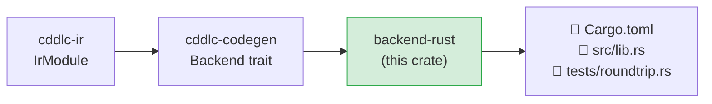
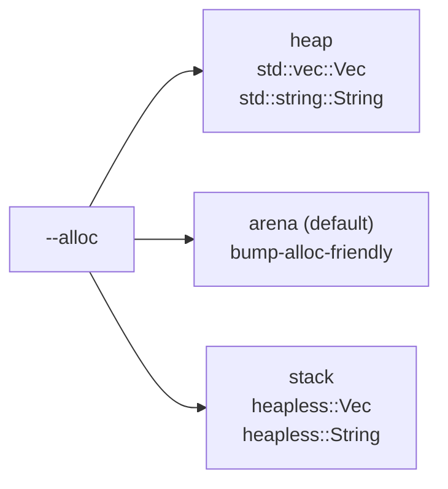

# backend-rust

Generates a complete Rust crate — `Cargo.toml`, `src/lib.rs`, and `tests/roundtrip.rs` —
from an `IrModule`.  The generated crate uses [minicbor](https://docs.rs/minicbor) (default)
for CBOR encoding and decoding, with optional `#![no_std]` support for embedded targets.

## Position in the pipeline



## Generated output layout

```
<output>/
  Cargo.toml          # crate manifest with minicbor dep
  src/
    lib.rs            # all generated types with encode/decode impls
  tests/
    roundtrip.rs      # #[test] for every type: encode → decode → assert_eq!
```

## Runtime options (`--runtime`)

| Runtime | Notes |
|---|---|
| `minicbor` (default) | Zero-copy, `#[no_std]`-compatible, derive-based; best for embedded |
| `ciborium` | Serde-based; integrates with the broader serde ecosystem |
| `cbor4ii` | Alternative serde + CBOR backend |

## Feature flags

| Option | Generated code change |
|---|---|
| `--no-std` | Adds `#![no_std]` + `extern crate alloc;`; uses `heapless::Vec` for arrays and `heapless::String` for `tstr` |
| `--dcbor` | Struct encode sorts map keys before writing (deterministic CBOR per RFC 8949 §4.2) |
| `--alloc stack` | Arrays backed by `heapless::Vec<T, N>` |
| `--alloc heap` | Arrays use `std::vec::Vec<T>` |
| `--namespace NS` | Wraps all types in `pub mod NS { … }` |

## What is generated per IR type

### Structs (`StructDef`)

```rust
#[derive(Debug, Clone, PartialEq)]
pub struct Device {
    pub id:     String,
    pub active: bool,
    pub label:  Option<String>,   // optional field
}

impl minicbor::Encode<()> for Device { … }
impl<'b> minicbor::Decode<'b, ()> for Device { … }
```

- CBOR encode: writes a definite-length map with string or integer keys.
- CBOR decode: reads map entries by key; handles optional fields.
- JSON encode/decode (when `--format json`): `serde::Serialize` + `Deserialize` derives.

### Enums (`EnumDef`)

```rust
pub enum Status { Ok, Warn, Error }
```

- String variants encode to/decode from a CBOR text string.
- Integer variants encode to/decode from a CBOR integer.
- Mixed variants use a tagged union encoding.

### Arrays (`ArrayDef`)

```rust
pub type Readings = Vec<f32>;              // --alloc heap
pub type Readings = heapless::Vec<f32, 16>; // --alloc stack / --no-std
```

### Aliases (`AliasDef`)

```rust
pub type DeviceId = String;               // with .size constraint → assertion in helpers
```

## Allocation strategies



## dCBOR support

When `--dcbor` is passed, struct encode implementations sort map entries by key before
writing.  This produces canonical CBOR output required for COSE signing.

## Constraint validation

| Constraint | Generated code |
|---|---|
| `.size N` | `assert!(s.len() == N)` |
| `.size (min..max)` | `assert!(s.len() >= min && s.len() <= max)` |
| `.range (a..b)` | `assert!(v >= a && v <= b)` |
| `.ge/.le N` | `assert!(v >= N)` etc. |
| `.regexp "pat"` | Calls user-supplied `@regex-hook` function |

## Known gaps and future enhancements

- **`ciborium` and `cbor4ii` runtimes**: only `minicbor` is fully implemented; others are
  accepted by the CLI but fall through to `minicbor` codegen.
- **Constraints as `TryFrom`**: constraints are currently emitted as `assert!` panics; a
  `TryFrom<RawType>` pattern returning `Result` would be more idiomatic.
- **No `Default` derive**: optional fields default to `None` but no `Default` impl is
  generated, which is useful for builder patterns.
- **`heapless` version pinning**: the generated `Cargo.toml` pins a specific `heapless`
  version; workspace conflicts can arise if the user already depends on a different version.
- **`@doc` as Rust `///` comments**: doc pragmas reach the IR but are not rendered as
  `///` doc-comment lines in the generated source.

## License

MIT OR Apache-2.0
